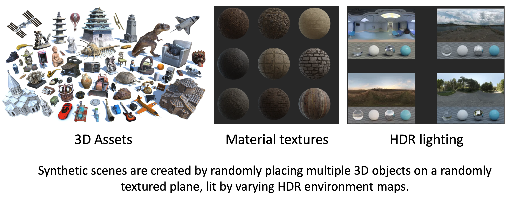

# Composition Rendering (Blender Data Generator)

<div align="center">
  
</div>

<div align="center">
  
</div>

Generate synthetic image datasets by composing multiple 3D objects on a plane and rendering them in Blender Cycles. The pipeline supports randomized placements, materials, HDRI environment lighting, and several camera/light motion modes. It produces RGB plus auxiliary features (normal, depth, albedo, roughness, metallic) and per-frame metadata. The generated data can be used for training generative rendering models such as [Diffusion Renderer](https://research.nvidia.com/labs/toronto-ai/DiffusionRenderer/), [UniRelight](https://research.nvidia.com/labs/toronto-ai/UniRelight/), and [LuxDiT](https://research.nvidia.com/labs/toronto-ai/LuxDiT/).

**Note: This repo is a blender-based re-implementation of the data generation pipeline used in Diffusion Renderer. Some rendering buffers may differ from the original implementation.**


### Key features
- **Asset composition**: place GLB/GLTF/OBJ assets plus optional basic shapes on a ground plane with collision-free grid placement.
- **Lighting**: sample HDRI environment maps (EXR/HDR) with optional flips, rotations, and exposure scalings.
- **Camera/motion**: orbiting camera, oscillating camera, orbiting environment light, object rotation, object vertical translation, and dolly zoom.
- **Outputs**: RGB, normal, depth, albedo, roughness, metallic, and `meta.json` with camera and environment parameters. Optional debug outputs (environment projections, placement grid, `.blend`).


## Installation

We install the Blender 4.2 as a Python package directly into the conda environment. This can avoid many dependancy issues, and is easier to configure the environment on remote server.

```bash
conda create -n blender python=3.11.0
conda activate blender
pip install -r requirements.txt
```

If you want to run the code on server machine, you might optionally need to install following conda pkg:
```bash
conda install conda-forge::gxx=11.4.0 mesalib glew glm menpo::glfw3 conda-forge::xorg-libx11 conda-forge::xorg-libxi conda-forge::xorg-libsm
```


## Quick Start

You can directly run example configs with provided assets:

```bash
python blender_datagen_compose.py --config configs/render_orbit_cam.yaml out_dir=output/blender_compose
```

You can also switch to different configs for different video rendering.


## Data and assets

- 3D assets: point `base_path` to a directory of assets or a text file listing absolute paths. Supported: `.glb`, `.gltf`, `.obj`.
- Environment maps: point `envlight` to a directory of `.exr`/`.hdr` files, a single file, or a `.txt` list.
- Ground plane: set `placement_plane` to a plane `.glb` (e.g., `data/plane_basic/plane.glb`).
- Basic shapes: set `baseshape_path` to a folder with shape `.glb` files (e.g., `data/basicshapes`).


Edit the config paths to match your rendering assets.


## Configuration reference


Configuration system:
- `--config`: YAML config file loaded with OmegaConf
- Dotlist overrides: pass `key=value` pairs after `--config` to override, e.g. `num_frames=8 video_mode=orbit_lgt`
  - Nested keys use dots, lists use brackets, e.g. `resolution=[512,512]`, `placement_plane_textures=data/textures`
Common keys:

The script loads defaults, then merges any keys from `--config`. Common keys:

Rendering and camera
- `resolution`: [H, W] image size (default [256, 256])
- `spp`: Cycles samples per pixel
- `use_denoise`: denoiser name or false (e.g., `"OPTIX"`, `"OPENIMAGEDENOISE"`, or `false`)
- `transparent_bg`: whether to render against transparent background
- `fov_range`: [min_deg, max_deg] horizontal FOV sampling range
- `radius_range`: [min, max] camera radius from origin; `varying_radius`: bool to vary per frame
- `video_mode`: one of `orbit_cam`, `oscil_cam`, `orbit_lgt`, `rotat_obj`, `vtran_obj`, `dolly_cam`
- `num_frames`: frames per sequence (e.g., 8)
- `num_rendering`: number of scenes to generate
- `cam_phi_range`: [min_deg, max_deg] azimuth; `cam_theta_range`: [min_deg, max_deg] elevation
- `cam_t_range`: per-axis camera look-at translation sampling (3D range)

Environment lighting
- `envlight`: directory, single file, or text file listing envmaps
- `env_scale`: default exposure multiplier
- `random_env_rotation`: randomly rotate envmap per frame/scene
- `random_env_flip`: optional horizontal flip
- `random_env_scale`: [min, max] random exposure scale per scene
- `num_lighting`: number of lighting variations per scene

Object sampling and placement
- `base_path`: directory or txt-file list of assets to sample
- `glbs_per_scene`: number of main assets per scene
- `glbs_scale_range`: [min, max] uniform scale
- `glbs_rotation_range`: [min_deg, max_deg] yaw rotation before placement
- `glbs_placement_bbox`: [min.x, min.y, max.x, max.y] placement region for main assets
- `glbs_rescale`: normalize loaded assets to unit box before scaling
- `baseshape_path`: directory of shape `.glb` files
- `shapes_per_scene`, `shapes_scale_range`, `shapes_rotation_range`, `shapes_placement_bbox`
- `placement_plane`: plane `.glb` path; `placement_plane_scale` and `placement_plane_offset`
- `placement_bbox`, `placement_grid_res`, `placement_bbox_scale`: grid-based collision avoidance
- `placement_plane_textures`: directory of PBR texture folders to apply to planes
- `texture_match_string`: glob for texture subfolders (e.g., `"*/*/textures"`)
- `texture_sample_weight`: optional dict of substring->weight to bias texture sampling

Dumping and debugging
- `dump_format`: image format for certain outputs (e.g., `"jpg"`)
- `dump_envmap`: save per-frame environment projections; `dump_ball_env`, `dump_env_bg`
- `dump_blend`: save `.blend` file per scene
- `dump_placement`: save a placement grid visualization
- `prefix_in_folder`: store lighting variants as separate subfolders per scene

Less common
- `envlight_sample_weight`, `plane_sample_weight`: optional substring->sampling weight for different sources of assets


## Output structure

Outputs are written under `out_dir`, inside a seed- and mode-specific subfolder. Example:

```text
output/blender_scenes/
  orbit_cam_s000042/
    000000/
      0000.meta.json
      0000.0000.rgb.png
      0000.0000.normal.jpg
      0000.0000.depth.exr
      0000.0000.albedo.jpg
      0000.0000.roughness.jpg
      0000.0000.metallic.jpg
      # optional (if enabled):
      0000.0000.env_ldr.jpg
      0000.0000.env_log.jpg
      placement.png
      scene.blend
    000001/
      ...
```

Naming: `<lgt_idx>.<frame_idx>.<pass>.<ext>`
- `rgb`: color frame (format depends on render settings)
- `normal`: camera-space normals mapped to [0,1] as JPG/PNG
- `depth`: linear depth as float EXR
- `albedo`: base color in sRGB as JPG/PNG
- `roughness`, `metallic`: scalar channels split from ORM AOV

`*.meta.json` contains per-scene/per-frame camera and environment info including camera matrices and envmap parameters, plus `mesh_list` with placement/material metadata.


## Development

- Main entrypoint: `blender_datagen_compose.py`
- Utilities: `utils/blender_utils.py`, `utils/render_utils.py`, `utils/image_utils.py`
- Example configs: `configs/*.yaml`

## Acknowledgments
WIP


## License

- Licensed under the [Apache License 2.0](./LICENSE).
- Third-party assets (e.g., Poly Haven models/HDRIs) retain their own licenses; ensure compliance when using/publishing generated datasets.

## Citation

If you find this repository useful, you might cite the following papers:

```bibtex
@inproceedings{liang2025diffusion,
  title={Diffusion Renderer: Neural Inverse and Forward Rendering with Video Diffusion Models},
  author={Liang, Ruofan and Gojcic, Zan and Ling, Huan and Munkberg, Jacob and Hasselgren, Jon and Lin, Chih-Hao and Gao, Jun and Keller, Alexander and Vijaykumar, Nandita and Fidler, Sanja and others},
  booktitle={Proceedings of the Computer Vision and Pattern Recognition Conference},
  pages={26069--26080},
  year={2025}
}

@article{he2025unirelight,
  title={UniRelight: Learning Joint Decomposition and Synthesis for Video Relighting},
  author={He, Kai and Liang, Ruofan and Munkberg, Jacob and Hasselgren, Jon and Vijaykumar, Nandita and Keller, Alexander and Fidler, Sanja and Gilitschenski, Igor and Gojcic, Zan and Wang, Zian},
  journal={arXiv preprint arXiv:2506.15673},
  year={2025}
}

@article{liang2025luxdit,
  title={LuxDiT: Lighting Estimation with Video Diffusion Transformer},
  author={Liang, Ruofan and He, Kai and Gojcic, Zan and Gilitschenski, Igor and Fidler, Sanja and Vijaykumar, Nandita and Wang, Zian},
  journal={arXiv preprint arXiv:2509.03680},
  year={2025}
}
```
